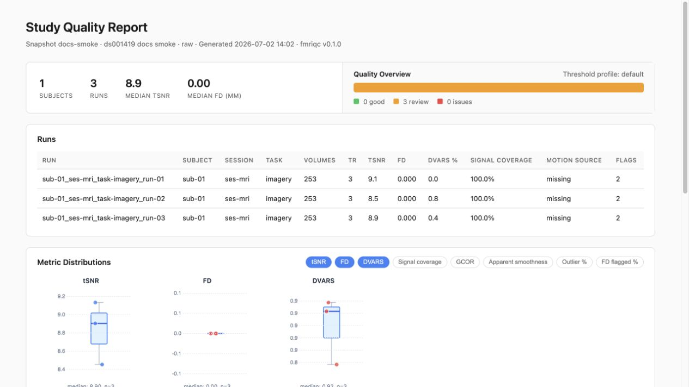
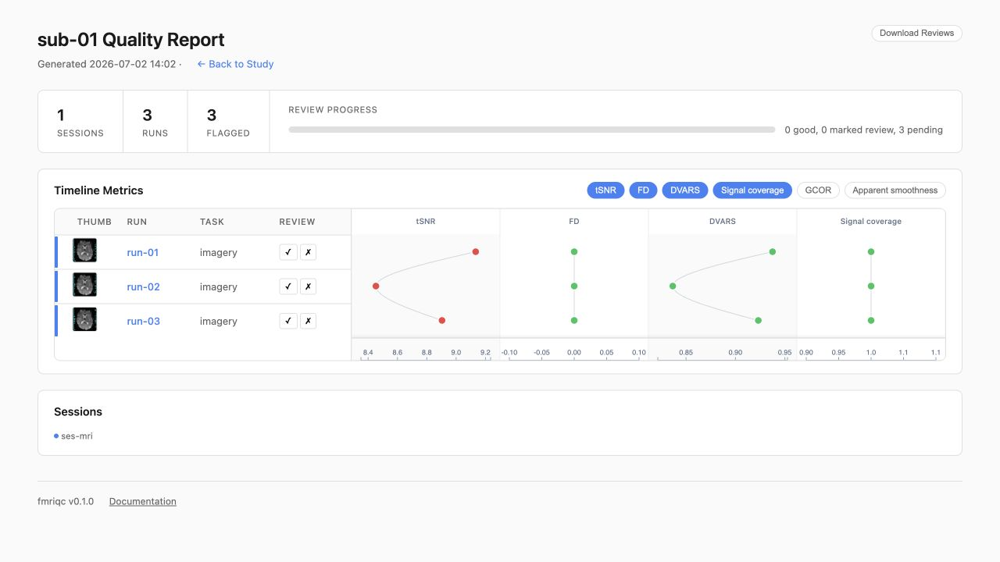
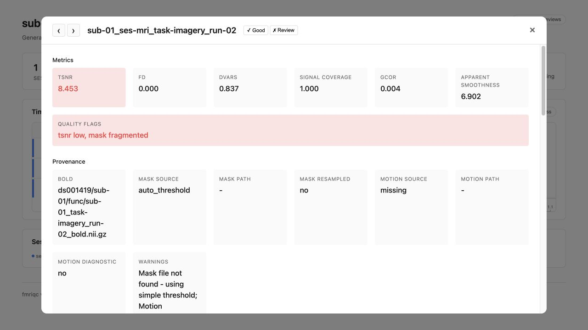

# Usage Guide

`fmriqc` has three workflows:

```bash
fmriqc assess [options]
fmriqc compare LEFT_QA_DIR RIGHT_QA_DIR -o OUTPUT
fmriqc report QA_DIR
```

If no subcommand is provided, arguments are interpreted as `assess` for
backward compatibility.

## Assess a Snapshot

From a manifest:

```bash
fmriqc assess --manifest snapshot.yaml -o QA_preproc --n-jobs 4
```

From a derivative directory:

```bash
fmriqc assess \
  --derivatives-dir /data/derivatives/fmriprep \
  --data-source fmriprep \
  --snapshot-id preproc \
  --snapshot-label "fMRIPrep output" \
  --snapshot-source-type preprocessed \
  -o QA_preproc
```

Print discovered runs without computing metrics:

```bash
fmriqc assess --manifest snapshot.yaml --dry-run
```

## Review the HTML Report

Every assessment writes an `index.html` study report inside a timestamped output
directory. Start there to scan snapshot-level metrics, run flags, motion
provenance, and distribution plots:



Open a subject report from the study page to review runs in context. The subject
timeline keeps thumbnails, review buttons, and aligned metric traces together:



Click a run label to inspect the run-level metrics, quality flags, provenance,
warnings, and generated visual assets:



## Motion Fallback

Prefer provided motion whenever possible. If a run lacks supported motion input,
you can ask `fmriqc` to generate MCFLIRT parameters:

```bash
fmriqc assess --manifest snapshot.yaml --generate-motion --n-jobs 2
```

Generated motion from already-preprocessed data is a residual realignment
estimate and is labeled as such in provenance.

## Candidate Review Support

Run-level quality flags are always available in the report and TSV exports.
Candidate review recommendations and candidate censor vectors are opt-in:

```bash
fmriqc assess \
  --manifest snapshot.yaml \
  --generate-review-recommendations \
  --exclusion-stringency moderate
```

These outputs are decision support. Final inclusion and censoring decisions
remain project policy.

## Compare Two Snapshots

Comparison consumes two completed QA output directories:

```bash
fmriqc compare \
  QA_raw/20260505_143000_snapshot-raw \
  QA_preproc/20260505_151200_snapshot-preproc \
  -o QA_compare/raw_vs_preproc
```

Runs are paired by canonical run key, not file path. Duplicate, left-only, and
right-only runs are reported rather than silently guessed.

## Cache and Reuse

Each assessment writes `qa_cache.json` inside its timestamped output directory.
That cache supports `fmriqc report` and explicit `--reuse-from` loading of a
completed QA directory. A normal repeat `assess` command creates a fresh
timestamped directory and does not currently use a shared persistent cache.

## Rebuild Reports

```bash
fmriqc report QA_preproc/20260505_151200_snapshot-preproc
```

## Python API

```python
from fmriqc.orchestration.config import QAConfig
from fmriqc.orchestration.core import run_assess

config = QAConfig.from_yaml("qa_config.yaml")
run_assess(config)
```

See also [SNAPSHOTS.md](SNAPSHOTS.md), [OUTPUTS.md](OUTPUTS.md), and
[COMPARISON.md](COMPARISON.md).
